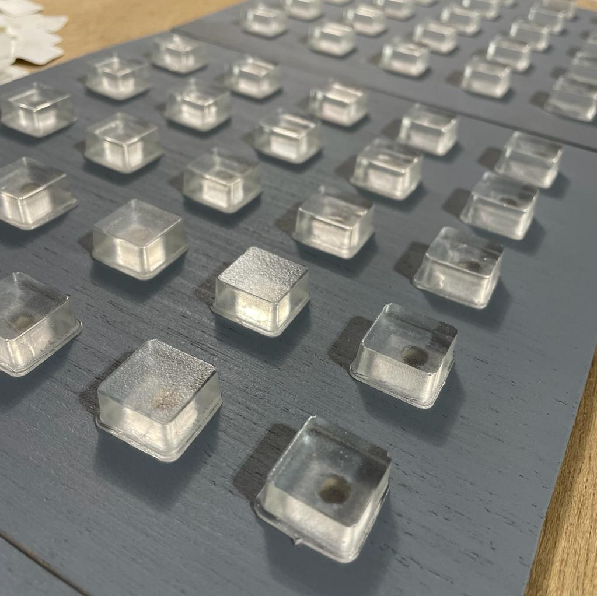
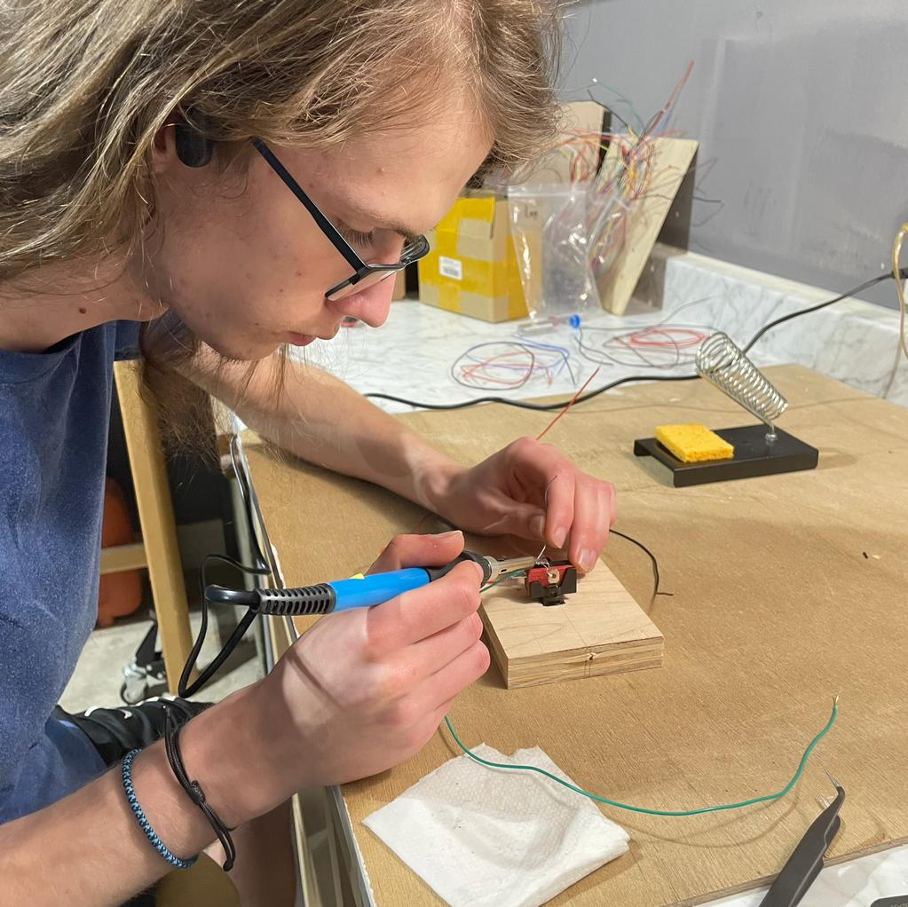
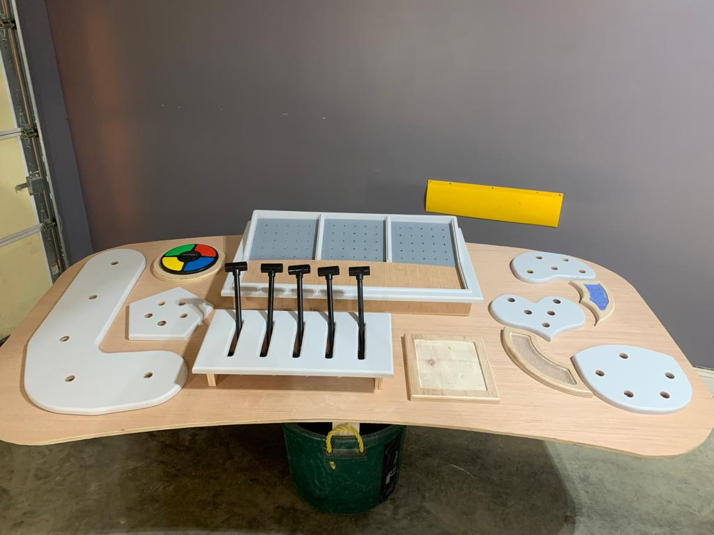
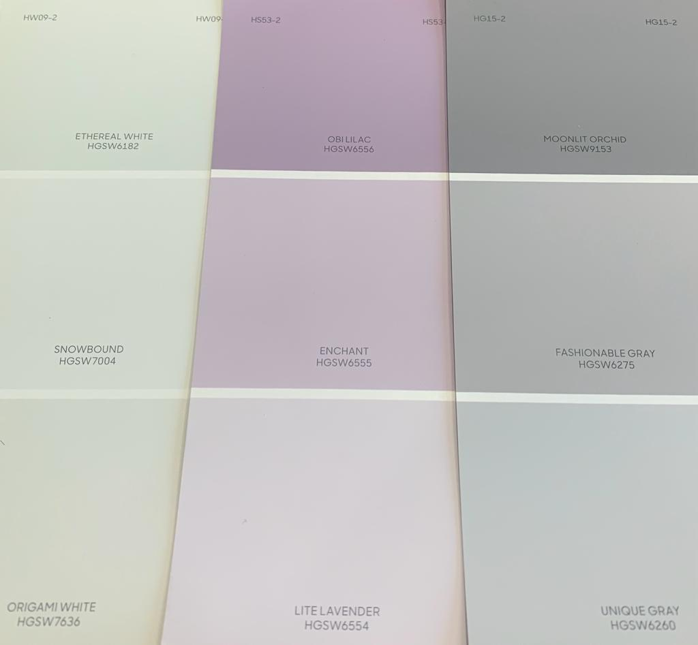
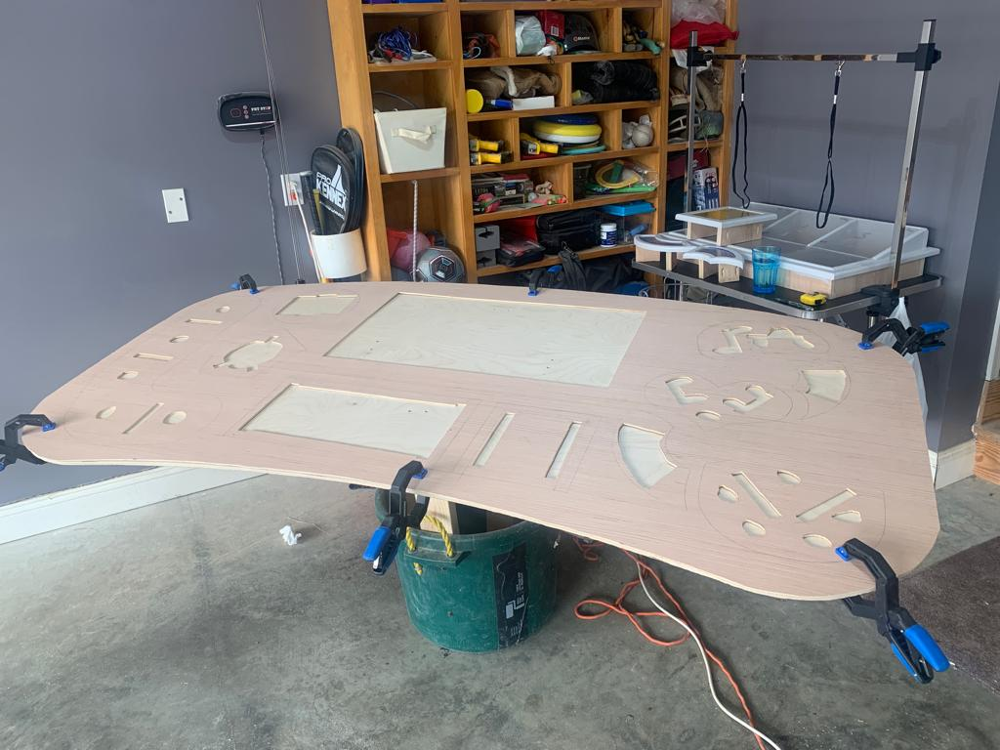

# Creation (by the Bunch Family)

**The project was completed in collaboration between Leon King and The Bunch Family**

The base of the table was delivered by Leon King.
The next step was to determine what would be put on it to make it the **Command Center** of "**Inside Out**".

Using paper cutouts we determined a general outline of what was going to be on it and what kind of buttons were to be used.

https://github.com/Titus-B/Insideout/assets/58118976/4301a380-c3ee-4f20-9ca6-70bf98d16ac7

We tested the buttons out to get an idea of how we wanted them to work and determined we wanted them to light up when pressed.

 

Then LEDs were then tested to determine if they would work as planned as fake buttons.

Since the fake buttons would work as planned, three 5 by 5 Fake LED button panels were made for the inside of the Control Panel.

Since the buttons would work as planned, the actual button components got their wiring soldered on.

 

Then using butcher block paper we cut out full scale panels that the buttons would sit on.
These were then glued onto a 3/4 inch plywood and cut out.

These panels then had holes drilled for the buttons, the edges routed so that the edges would be rounded, and supports added so that they could sit in the table when the top was added on later.

 

After all the panels had all of the cutting, sanding, and routing done they were painted Unique Gray.

Then the top was planned out so that it could have cutouts for each of the panels.

Then the edges of the tables were planned and made by steaming wood.

  

1" by 3" was used for the sides and 0.25" by 3" for the corners. The 0.25" by 3" was used because the 1" by 3" were not bending enough.

The wiring inside the table was then added.

 

Then the top was then glued on.

The edges of the table were then routed one last time to ensure that the edges were smooth. Then the final act of wiring everything up was left.

Then it was painted Snowbound

Details on how this was done can be found in the [Readme](https://github.com/Titus-B/Insideout/blob/main/Readme.md).

With all of the LEDs complete all that was left was to figure out if we could get audio to work.

The first step was to get a working prototype, which was done on the Arduino Uno.

   

Once we could get the sound to play on the small speakers with the Uno we transfered the code to the Mega and put in the speakers.

There we had a few issues and after some trouble shooting and changing where wires connected to the Mega it started to work.

Then we ran into the issue of the 2 small speakers not being loud enough. so we upgraded to a larger speaker hidden in the base and powering it with an amp.

This was much louder, but still quieter than the ambiant noise in the atrium of the Church.

With that it was complete.

    
