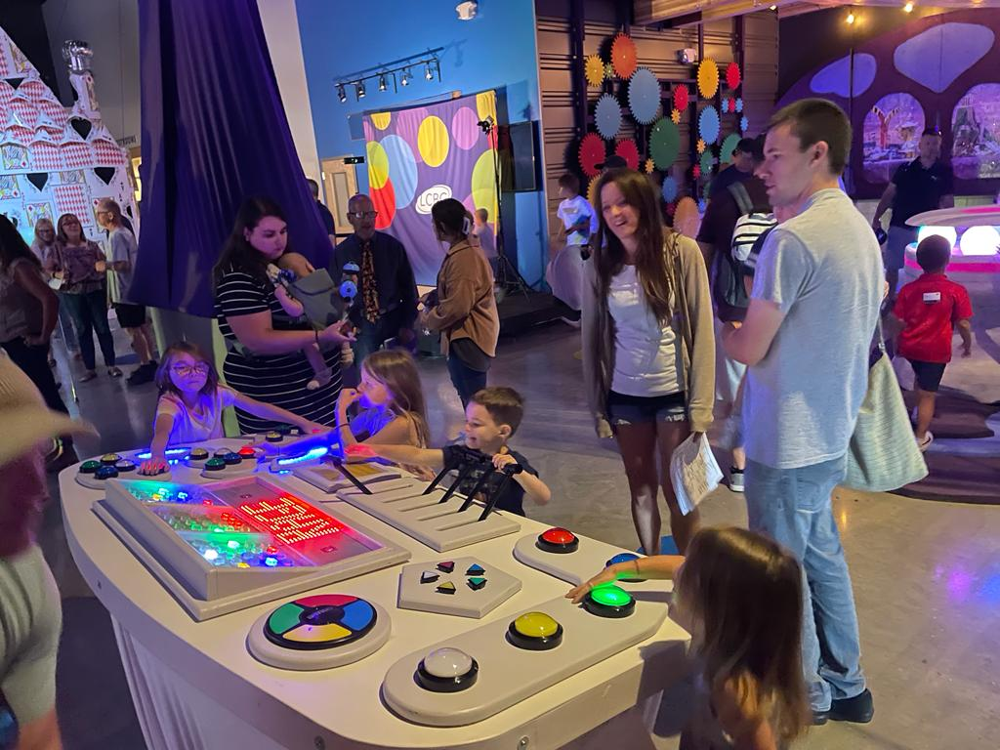
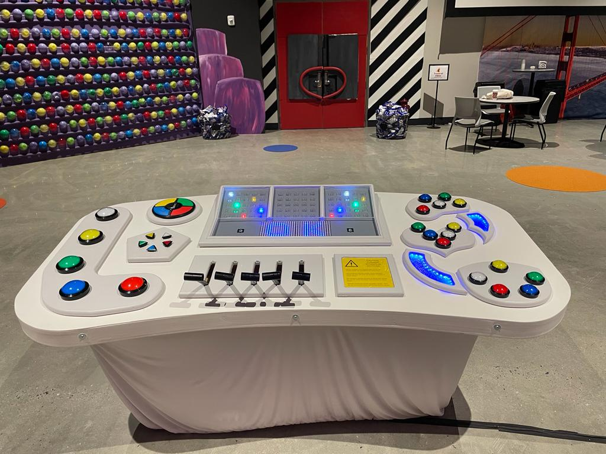
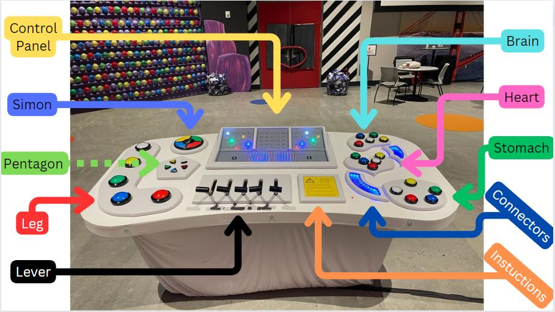
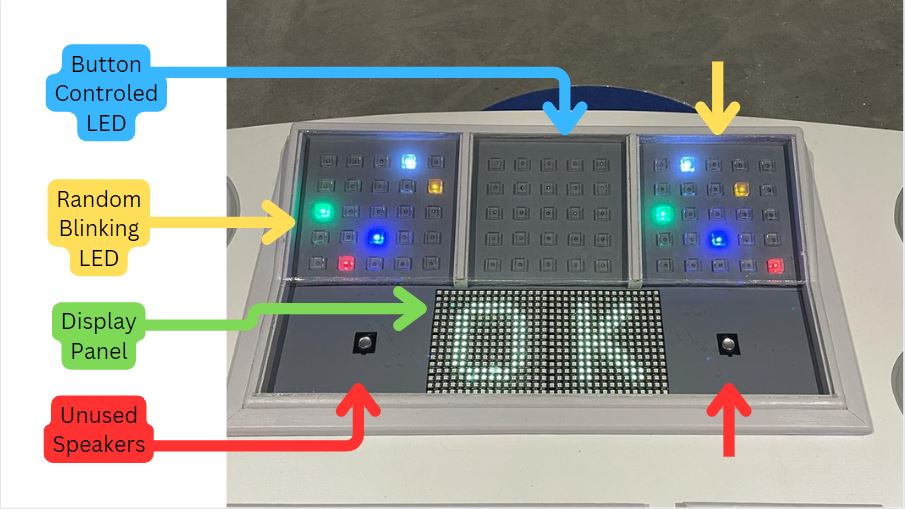
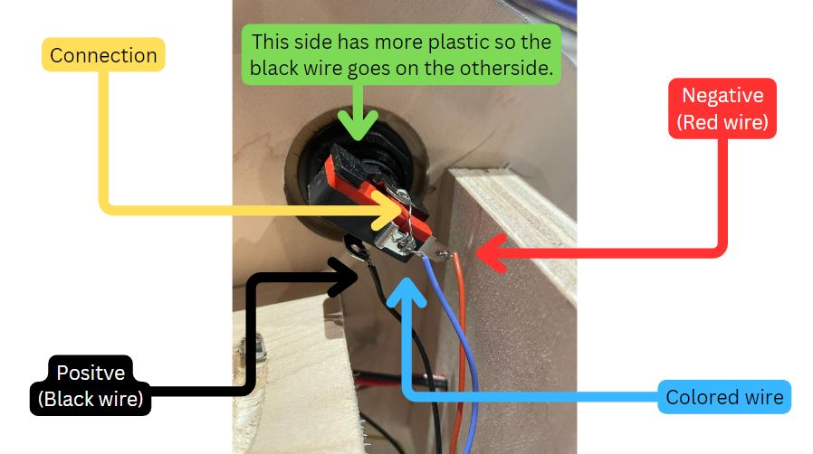
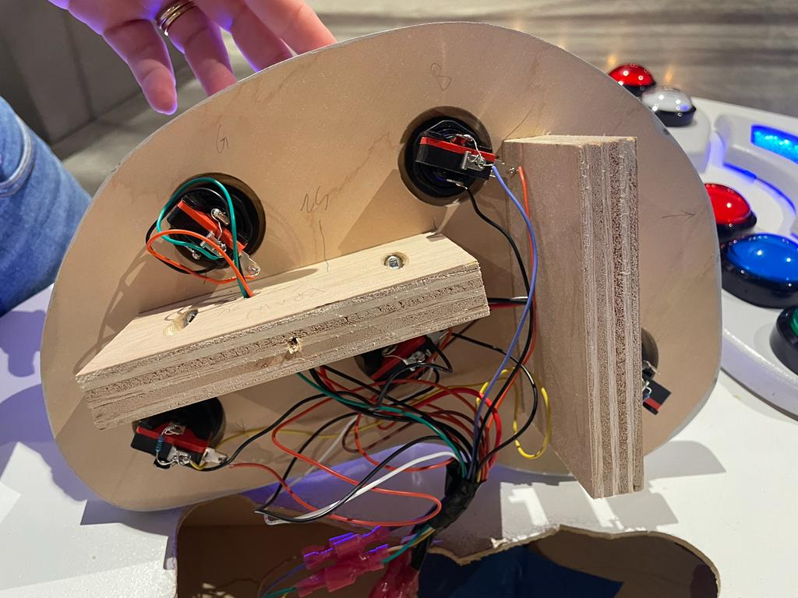

# Inside-Out Control Panel

 

   **Created for LCBC Westshore At The Movies (ATM) 2023**

  **The Control Panel from the Disney and Pixar Film "Inside Out"**

  **The project was completed in collaboration between Lean King and The Bunch Family**

# Terminology:
**Button Panels:**
  Leg, Pentagon, Brain, Heart, and Stomach.
  
**Non Button Panel:** Connector, Simon, Levers, Instructions, and Control Panel

 

# Wiring of Button Panels and Connectors:
**Each of the Button Panels have 7 connection points beneath them. Each color connects to itself.**  
  
    For example, the brain has a green, brown, yellow, white, blue, red, and black wire coming out of it. 
    On the table there is are the same color of wires. The wires connect to the wire of the same color. 

  **The Connector panels only have 2 wires, but they follow the same convention as the Button Panels.**

  (The connectors are all red)

 

  
# Wiring inside of the Control Panel:
**Where the wires from the Button Panels conect to Arduino Mega**

    ------------------------------------------------------------
    | Leg:               | Pentagon:        | Brain:           |
    |   White   - 22     |    White   - 27  |    White   - 32  |
    |   Yellow  - 23     |    Yellow  - 28  |    Yellow  - 33  |
    |   Red     - 24     |    Red     - 29  |    Red     - 34  |
    |   Blue    - 25     |    Blue    - 30  |    Blue    - 35  |
    |   Green   - 26     |    Green   - 31  |    Green   - 36  |
    ------------------------------------------------------------
    | Heart:           | Stomach:           |
    |    White   - 37  |   White   - 42     |
    |    Yellow  - 38  |   Yellow  - 43     |
    |    Red     - 39  |   Red     - 44     |
    |    Blue    - 40  |   Blue    - 45     |
    |    Green   - 41  |   Green   - 46     |
    -----------------------------------------

**Where the wires from the SD Card conect to Arduino Mega**

    CS   - 53                       VCC  - 5V supply (from Arduino)
    SCK  - 52                       GND  - Gnd       (from Arduino)
    MOSI - 51
    MISO - 50

**Where the wires from the Amp conect to Arduino Mega/Speaker**

    Input:
      GND - GND       (from Arduino)
      GND - Nothing
      IN  - 5
      VCC - 5V supply (from Arduino)

    Output:
      GND - GND       (of Speaker/Black Wire)
      OUT - Positive  (of Speaker/Red Wire)

**Where the wires from the Speaker conect to Amp**

    Red/+    : Red wire           |           Black/-  : Black wire
  
# Code:
  To upload code to the arduino you can follow these [instructions](https://support.arduino.cc/hc/en-us/articles/4733418441116-Upload-a-sketch-in-Arduino-IDE) by Arduino.
  
  **The Arduino Mega has the Screen_and_Sound.Ino uploaded to it.**
  (The larger one)
 
  **The Arduino Uno has the LED_Random.ino uploaded to it.**
  (The smaller one)

# Maintenance
  For maintenence issues head to [Maintenance.md](https://github.com/Titus-B/Insideout/blob/234d1d6fa594f4346de9612675c5b217f1674af3/Maintenance.md)

# Creation
  For how it was made head to [Creation.md](https://github.com/Titus-B/Insideout/blob/234d1d6fa594f4346de9612675c5b217f1674af3/Creation.md)
